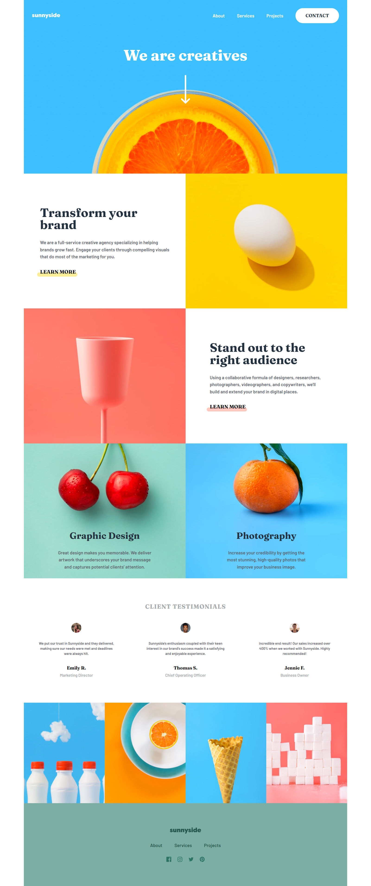

# Frontend Mentor - Crowdfunding product page solution

This is a solution to the [Sunnyside agency landing page challenge on Frontend Mentor](https://www.frontendmentor.io/challenges/sunnyside-agency-landing-page-7yVs3B6ef).

## Table of contents

- [Overview](#overview)
  - [The challenge](#the-challenge)
  - [Screenshot](#screenshot)
  - [Links](#links)
- [My process](#my-process)
  - [Built with](#built-with)
  - [Useful resources](#useful-resources)
- [Author](#author)

## Overview

### The challenge

Users should be able to:

- View the optimal layout for the site depending on their device's screen size
- See hover states for all interactive elements on the page

### Screenshot

### Links

- Solution URL: [https://github.com/Naveed89-tech/Crwod-Funding-Project]
- Live Site URL: [https://sunnysidelandingpagedigital.netlify.app/]

## My process

### Built with

- Semantic HTML5 markup
- CSS custom properties
- Tailwind CSS
- Flexbox
- CSS Grid
- Javascript

### Useful resources

- [https://tailwindcss.com/docs/installation](https://tailwindcss.com/docs/installation) - This helped me to remembered the very useful CSS concept and how i can use them with tailwind CSS reason. I really liked this pattern and will use it going forward.

## Author

- Frontend Mentor - [@Naveed89-tech](https://www.frontendmentor.io/profile/Naveed89-tech)
- Twitter - [@Naveed_Tech_T](https://twitter.com/Naveed_Tech_T)
